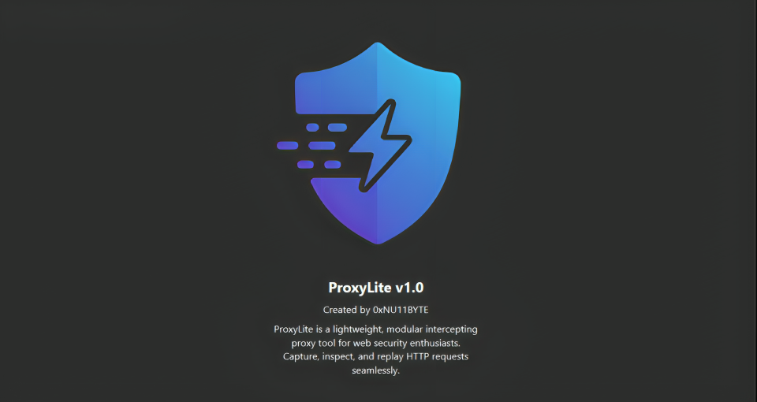
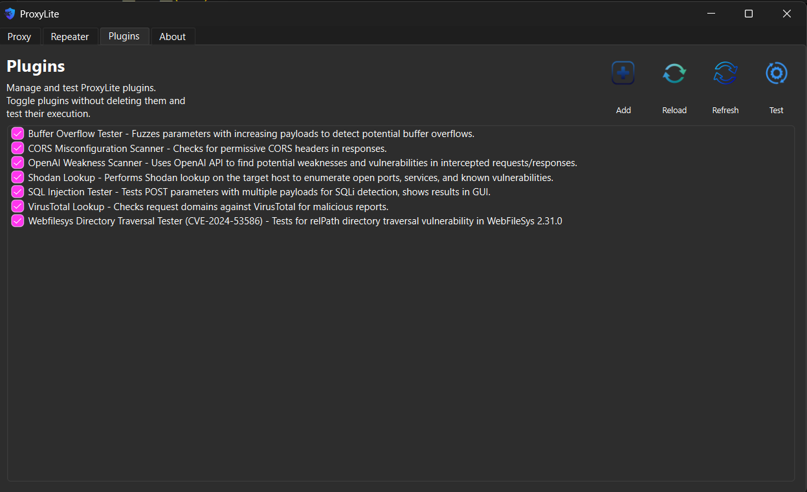

# ProxyLite

---
# ProxyLite

ProxyLite is an open-source, lightweight HTTP/HTTPS proxy and request tester designed for security researchers, penetration testers, and developers. It combines a clean, modular architecture built with PySide6 and mitmproxy, offering both usability and powerful extensibility.

## Key Features

- **Traffic Capture Module:**  
  Monitor and capture live HTTP and HTTPS requests and responses in real-time, with full inspection and modification capabilities.

- **Request Crafting Console:**  
  Build, edit, and resend HTTP requests effortlessly to probe APIs, web applications, or services, and immediately analyze the responses.

- **Plugin-Friendly:**  
  Extend ProxyLite’s core with custom plugins—create your own testing, exploitation, or automation tools easily.

- **Modern UI:**  
  Intuitive PySide6-based interface with a clean, user-friendly design optimized for productivity.

- **Flexible Architecture:**  
  Seamlessly integrates with popular Python libraries like mitmproxy and requests, making scripting and automation straightforward.

---

ProxyLite empowers users to quickly discover vulnerabilities, debug web services, and experiment with HTTP traffic — all within a lightweight and customizable framework.


## Usage
1. Install dependencies:
```
pip install -r requirements.txt
```
2. Run ProxyLite:
```
python proxylite.py
```
3. Set your browser/system proxy to `127.0.0.1:8080`.
4. Use Intercept/Repeater tabs for workflow.

## Features
- Live intercept using mitmproxy
- Request crafting and sending
- Response viewing
- Modular for future extensions

  # ProxyLite Plugins

ProxyLite is a flexible, modular intercepting proxy designed for **pentesters, bug bounty hunters, and developers** who want to extend its functionality easily using **plugin architecture**.
---

---

## Why Plugins?

* Extend ProxyLite for custom workflows.
* Automate repetitive pentest checks.
* Integrate external services directly into your workflow.
* Share and reuse community plugins.

## Current Plugins Available

### 1️⃣ Shodan Lookup

* Checks intercepted domains and IPs against the Shodan API.
* Displays open ports, banner data, and known vulnerabilities directly inside ProxyLite.
* Useful for quick OSINT and exposure analysis.

### 2️⃣ VirusTotal Local

* Checks domains, IPs, and hashes in requests/responses against VirusTotal.
* Local plugin using your API key for fast reputation checking.
* Highlights potential malware domains and compromised assets.

### 3️⃣ SQLi Tester

* Tests URL and parameter fields automatically for **SQL Injection** payloads.
* Supports Boolean-based, error-based, and time-based checks.
* Highlights vulnerable parameters directly inside ProxyLite.

### 4️⃣ CORS Checker

* Scans endpoints for **CORS misconfigurations**.
* Detects wildcard origins, insecure allow credentials, and reflection issues.
* Outputs clear misconfiguration warnings for pentesters.

### 5️⃣ OpenAI Weakness Scanner

* Uses OpenAI API to analyze captured requests/responses.
* Identifies potential security weaknesses and misconfigurations.
* Generates concise, actionable vulnerability summaries using LLM analysis.

### 6️⃣ Header Security Checker

* Scans intercepted responses for missing or weak security headers.
* Checks for CSP, X-Frame-Options, HSTS, X-Content-Type-Options, and others.
* Reports improvement recommendations for hardening.

### 7️⃣ JavaScript Endpoint Extractor

* Extracts JavaScript endpoints from intercepted traffic.
* Parses and lists potential hidden APIs for testing.

### 8️⃣ Passive Recon Plugin

* Performs WHOIS, subdomain enumeration, and DNS records lookup.
* Useful for passive footprinting during recon workflows.

---

## Developing Your Own Plugins

ProxyLite supports **hot-reloadable plugins**:

* Plugins are placed under `proxylite/plugins/`.
* Each plugin has a structured template:

  * `name`, `description`, `author`.
  * `run(self, request, response)` method to process flows.
* Uses simple Python with direct request/response object access.

**Example plugin skeleton:**

```python
name = "My Custom Plugin"
description = "Example plugin for testing headers."
author = "YourName"

def run(request, response):
    if "admin" in request.url:
        print("[!] Admin panel detected:", request.url)
```

You can also load payload files, generate automated scans, or call external APIs within your plugin.

---

## Contributing Plugins

* Submit your plugins via pull requests to the ProxyLite GitHub repository.
* Share them in the community to help others enhance ProxyLite.
* Join discussions for ideas on advanced exploitation modules.

---

ProxyLite aims to be the **lightweight Burp alternative** for tinkerers, researchers, and practical pentesters with **extensible plugin-based power.**

<p align="center">
  <a href="https://github.com/0xnu11byte">
    
  </a>
  &nbsp;&nbsp;&nbsp;&nbsp;
<!--   <a href="https://www.linkedin.com/in/YourLinkedIn/">
    
  </a> -->
  <a href="https://www.instagram.com/nu11byte/">
    
  </a>
</p>
